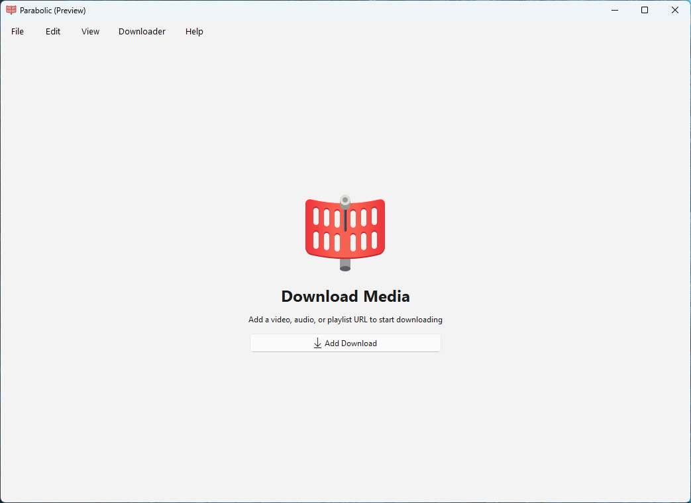
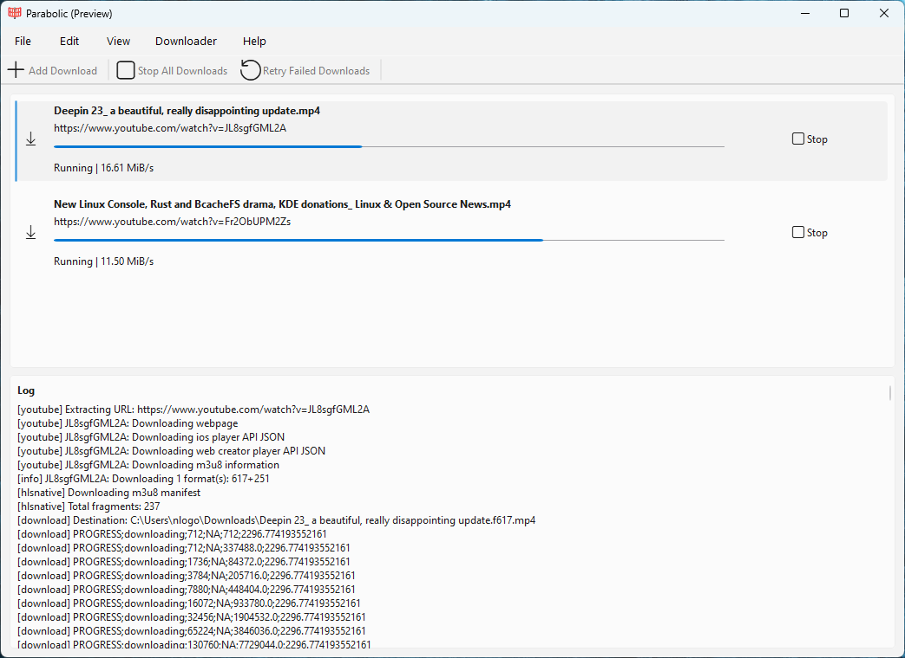
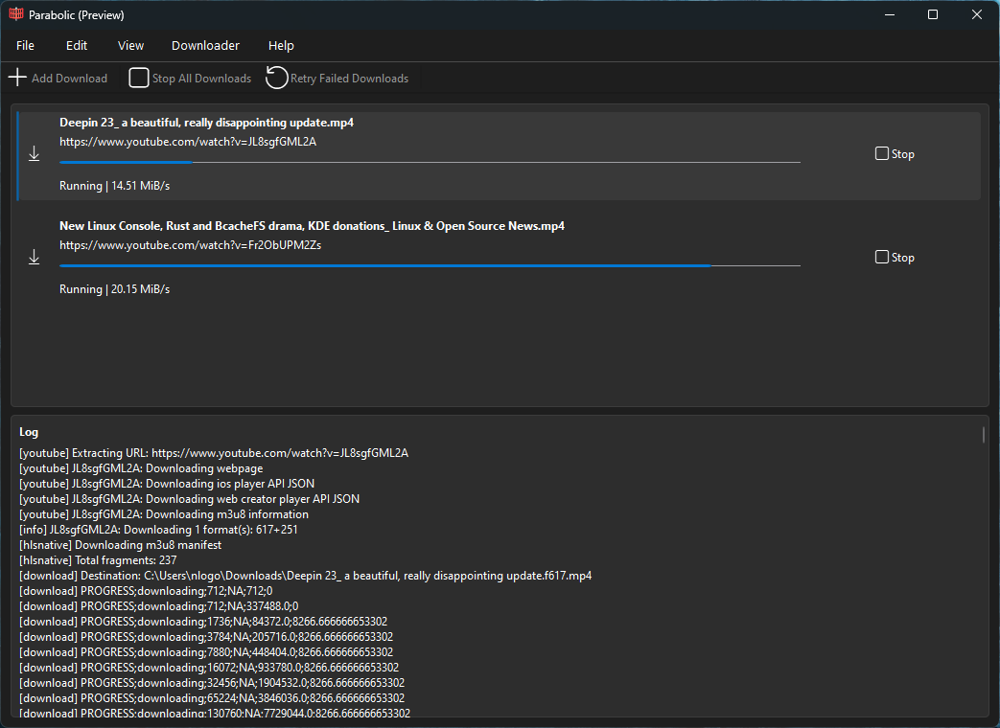
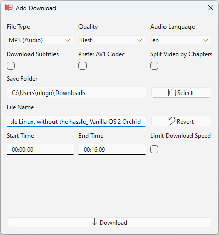

 ✨Powered by [Weblate](https://weblate.org/en/)✨

# Features
- A basic yt-dlp frontend ([supported sites](https://github.com/yt-dlp/yt-dlp/blob/master/supportedsites.md))
- Supports downloading videos in multiple formats (mp4, webm, mp3, opus, flac, and wav)
- Run multiple downloads at a time
- Supports downloading metadata and video subtitles

# Disclaimer
The authors of Nickvision Parabolic are not responsible/liable for any misuse of this program that may violate local copyright/DMCA laws. Users use this application at their own risk.

# Installation

# Chat

# Contributing
See [CONTRIBUTING.md](CONTRIBUTING.md) for details on how can you help the project and how to provide information so we can help you in case of troubles with the app.

# Screenshots

 
GNOME

 
 
 
 

 
QT

 
 
 
 

## Building Manually
Parabolic uses `vcpkg` to manage its dependencies and `cmake` as its build system.

Ensure both `vcpkg` and `cmake` are installed on your system before building.

A C++20 compiler is also required to build Parabolic.

### Configuring vcpkg
1. Set the `VCPKG_ROOT` environment variable to the path of your vcpkg installation's root directory.
#### Windows
1. Set the `VCPKG_DEFAULT_TRIPLET` environment variable to `x64-windows`
1. Run `vcpkg install boost-date-time gtest libnick qtbase qtsvg qttools`
#### Linux (GNOME)
1. Set the `VCPKG_DEFAULT_TRIPLET` environment variable to `x64-linux`
1. Run `vcpkg install boost-date-time gtest libnick libxmlpp`
#### Linux (QT)
1. Set the `VCPKG_DEFAULT_TRIPLET` environment variable to `x64-linux`
1. Run `vcpkg install boost-date-time gtest libnick qtbase qtsvg qttools`

### Building
1. First, clone/download the repo.
1. Open a terminal and navigate to the repo's root directory.
1. Create a new `build` directory and `cd` into it. 
#### Windows
1. From the `build` folder, run `cmake .. -G "Visual Studio 17 2022"`.
1. From the `build` folder, run `cmake --build . --config Release`.
1. After these commands complete, Parabolic will be successfully built and its binaries can be found in the `org.nickvision.tubeconverter.qt/Release` folder of the `build` folder.
#### Linux (GNOME)
1. From the `build` folder, run `cmake .. -DCMAKE_BUILD_TYPE=Release -DUI_PLATFORM=gnome`.
1. From the `build` folder, run `cmake --build .`.
1. After these commands complete, Parabolic will be successfully built and its binaries can be found in the `org.nickvision.tubeconverter.gnome` folder of the `build` folder.
#### Linux (QT)
1. From the `build` folder, run `cmake .. -DCMAKE_BUILD_TYPE=Release -DUI_PLATFORM=qt`.
1. From the `build` folder, run `cmake --build .`.
1. After these commands complete, Parabolic will be successfully built and its binaries can be found in the `org.nickvision.tubeconverter.qt` folder of the `build` folder.

# Code of Conduct
This project follows the [GNOME Code of Conduct](https://conduct.gnome.org/).
