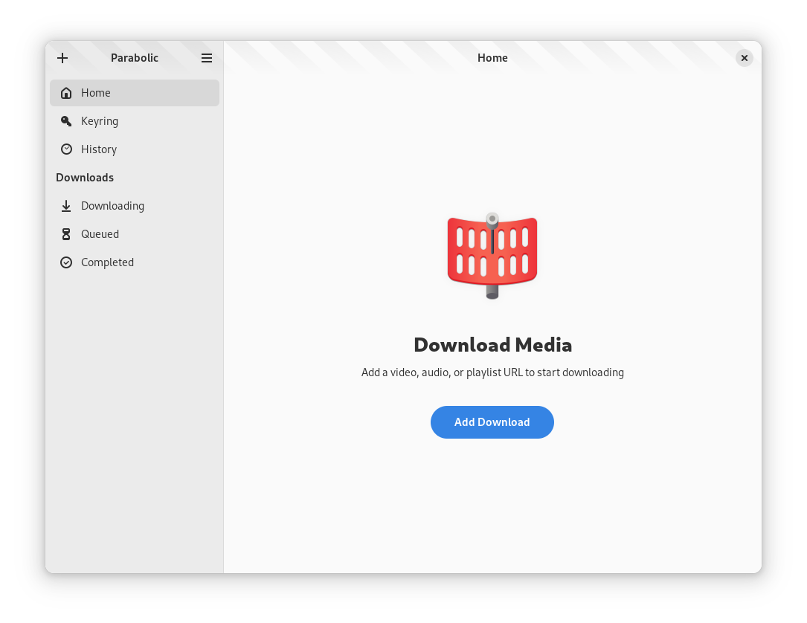
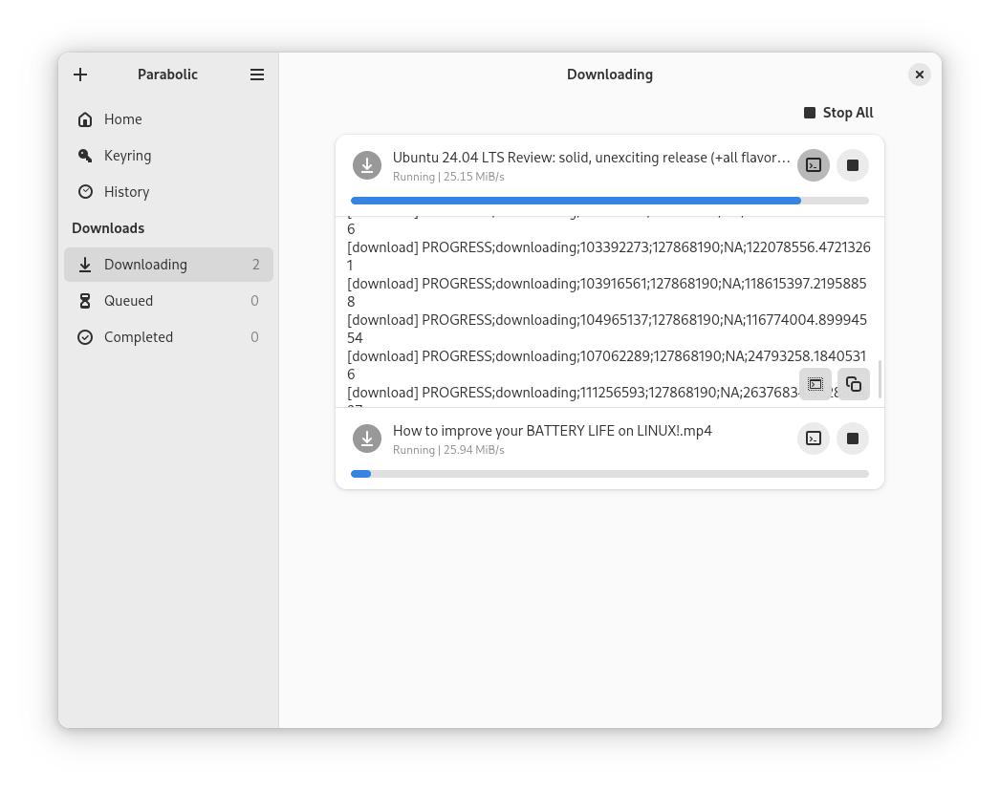
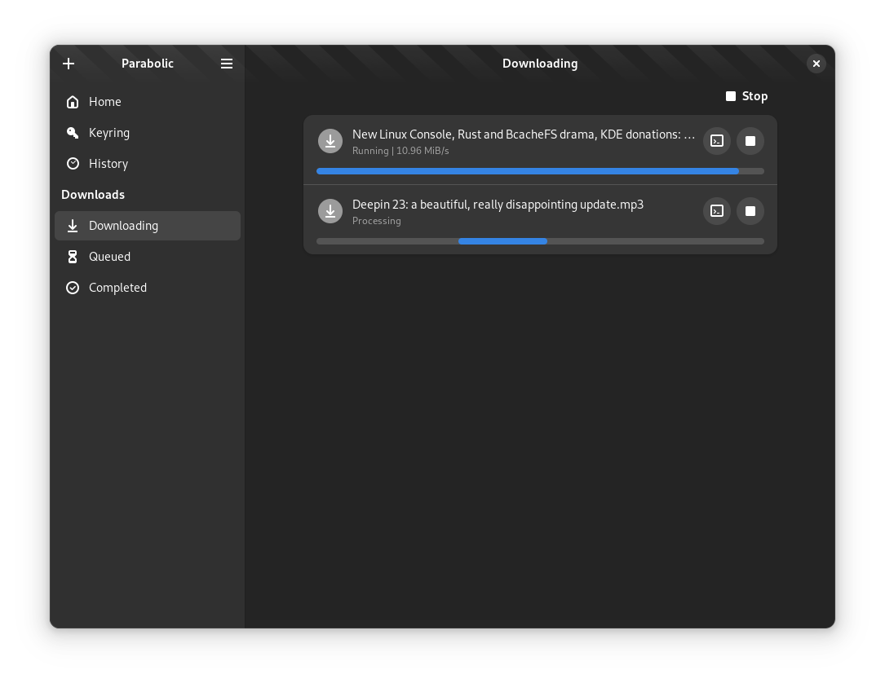
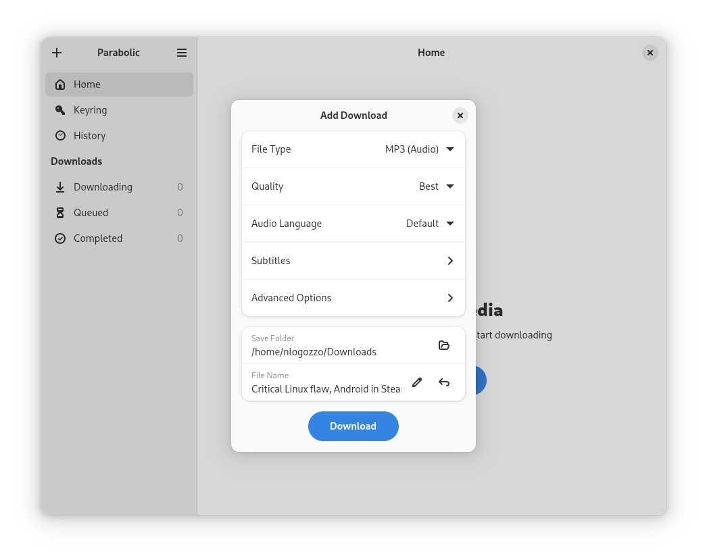
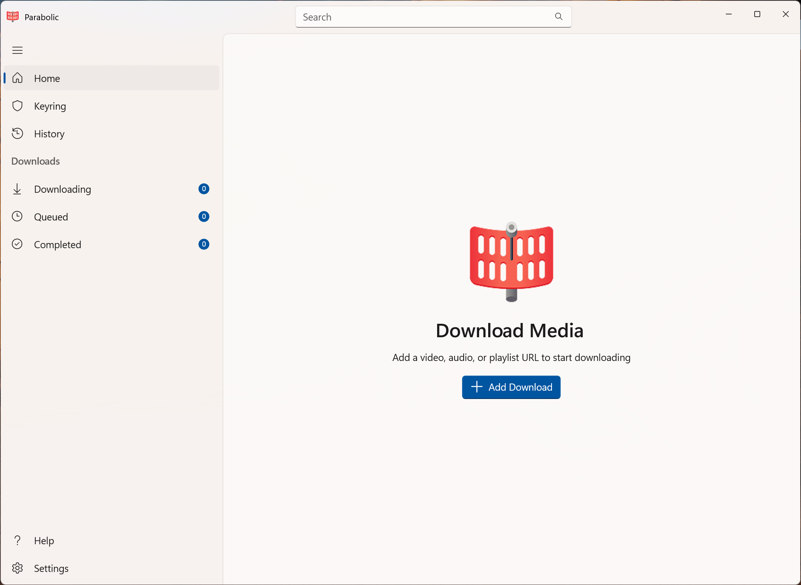
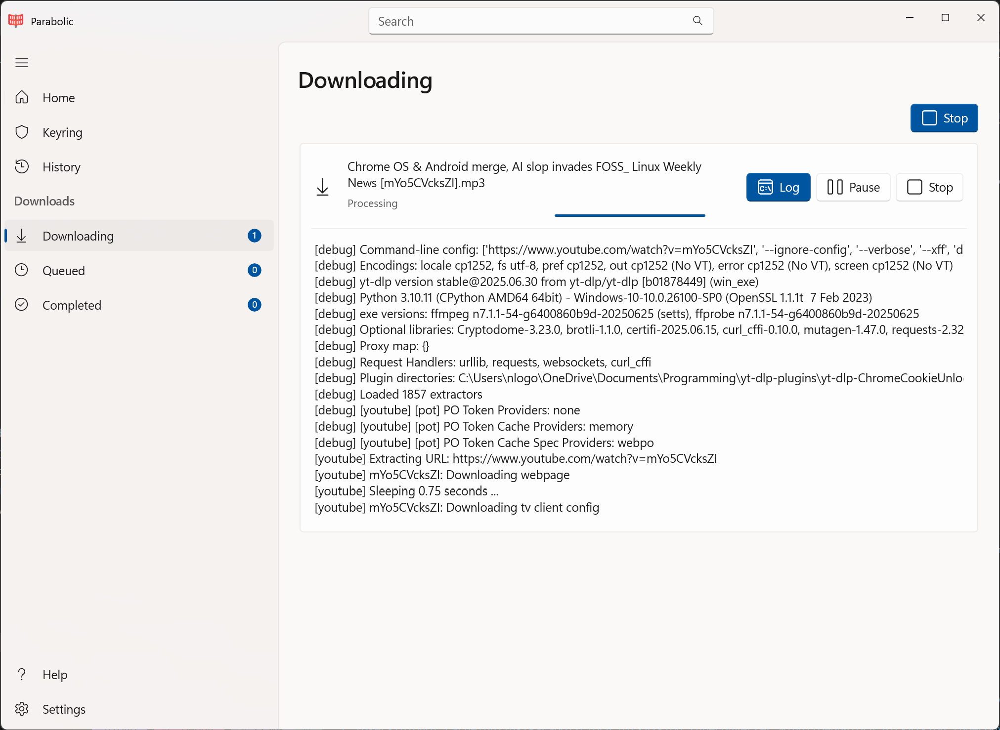
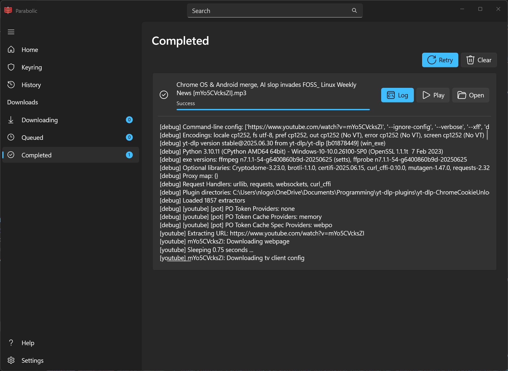
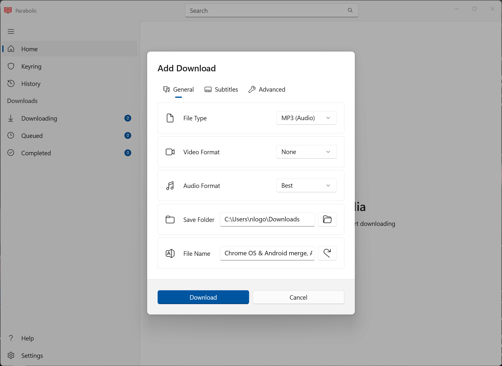

 ✨Powered by [Weblate](https://weblate.org/en/)✨

# Features
- A powerful yt-dlp frontend ([supported sites](https://github.com/yt-dlp/yt-dlp/blob/master/supportedsites.md))
- Supports downloading videos in multiple formats (mp4, webm, mp3, opus, flac, and wav)
- Run multiple downloads at a time
- Supports downloading metadata and video subtitles

# Legal Copyright Disclaimer
Videos on YouTube and other sites may be subject to DMCA protection. The authors of Parabolic do not endorse, and are not responsible for, the use of this application in means that will violate these laws.

# Installation

# Chat

# Contributing
See [CONTRIBUTING.md](CONTRIBUTING.md) for details on how can you help the project and how to provide information so we can help you in case of troubles with the app.

# Screenshots

 
GNOME

 
 
 
 

 
WinUI

 
 
 
 

  
Chrome Extension

  <video width="800" height="600" controls>
    <source src="extension/resources/chrome.mp4" type="video/mp4">
  </video>

  
Firefox Extension

  <video width="800" height="600" controls>
    <source src="extension/resources/firefox.mp4" type="video/mp4">
  </video>

## Building Manually
Parabolic uses `cmake` as its build system and `vcpkg` to *optionally* manage its dependencies.

Ensure `cmake` and `vcpkg` are installed on your system before building and installing Parabolic.

A C++20 compiler is also required to build Parabolic.

### Dependencies
The following are a list of dependencies used by Parabolic.

The recommendation is to (and below commands will) use vcpkg to pull these dependencies. However, vcpkg is not a requirement as long as the system provides these dependencies correctly.

#### All Platforms
- `libnick`
- `boost-date-time`

#### Linux
- `blueprint-compiler` (Not available from vcpkg)
- `libxmlpp`

### Configuring vcpkg
1. Set the `VCPKG_ROOT` environment variable to the path of your vcpkg installation's root directory.
#### Windows
1. Set the `VCPKG_DEFAULT_TRIPLET` environment variable to `x64-windows`
1. Run `vcpkg install libnick boost-date-time`
#### Linux
1. Set the `VCPKG_DEFAULT_TRIPLET` environment variable to `x64-linux`
1. Run `vcpkg install libnick libxmlpp boost-date-time`

### Building
1. First, clone/download the repo.
1. Open a terminal and navigate to the repo's root directory.
1. Create a new `build` directory and `cd` into it.
#### Windows
1. From the `build` folder, run `cmake .. -G "Visual Studio 17 2022"`.
1. From the `build` folder, run `cmake --build . --config Release`.
1. After these commands complete, Parabolic will be successfully built and its binaries can be found in the `org.nickvision.tubeconverter.winui/Release` folder of the `build` folder.
#### Windows (Portable)
1. From the `build` folder, run `cmake .. -G "Visual Studio 17 2022" -DBUILD_AS_PORTABLE=ON`.
1. From the `build` folder, run `cmake --build . --config Release`.
1. After these commands complete, Application will be successfully built and its binaries can be found in the `org.nickvision.application.winui/Release` folder of the `build` folder.
#### Linux
1. From the `build` folder, run `cmake .. -DCMAKE_BUILD_TYPE=Release`.
1. From the `build` folder, run `cmake --build .`.
1. After these commands complete, Parabolic will be successfully built and its binaries can be found in the `org.nickvision.tubeconverter.gnome` folder of the `build` folder.

# Code of Conduct
This project follows the [GNOME Code of Conduct](https://conduct.gnome.org/).
