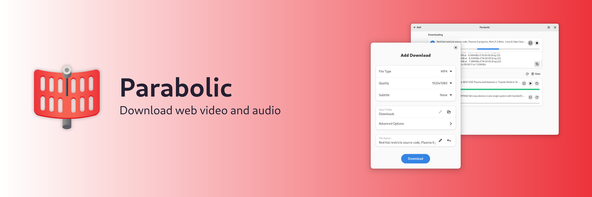
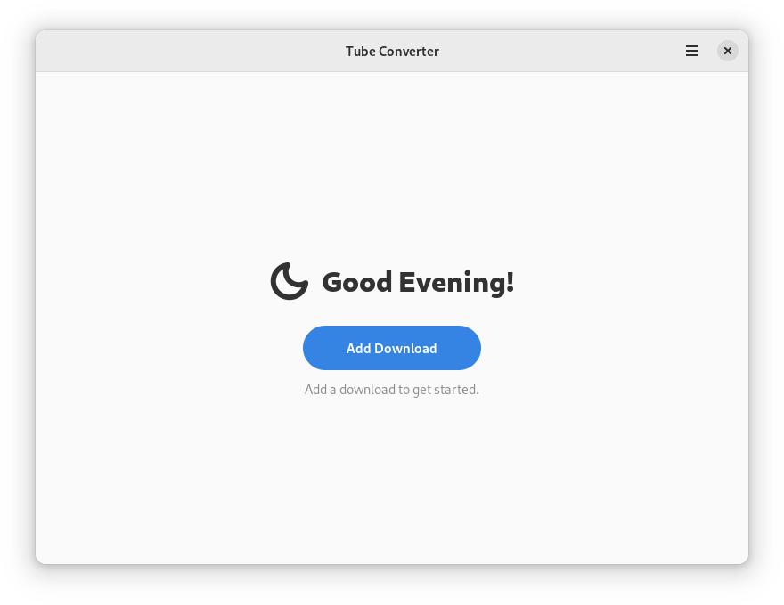
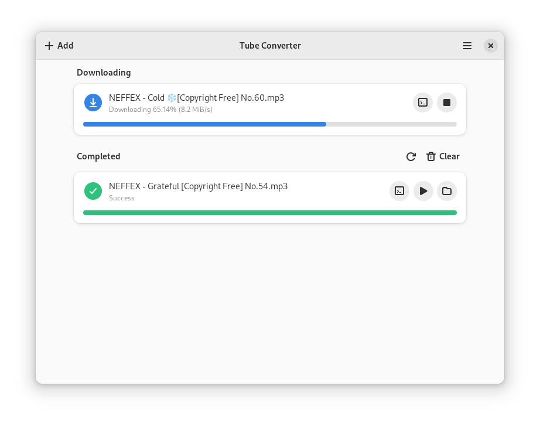
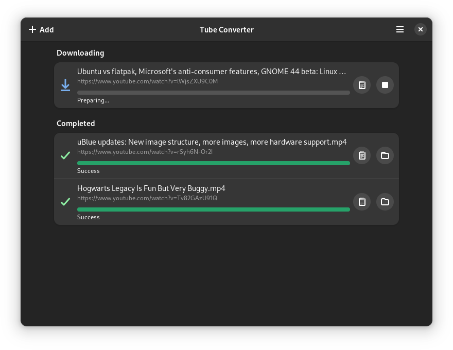
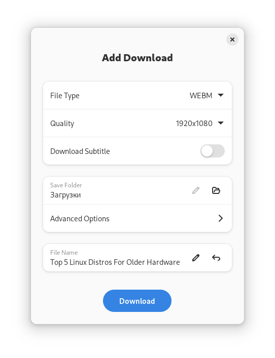
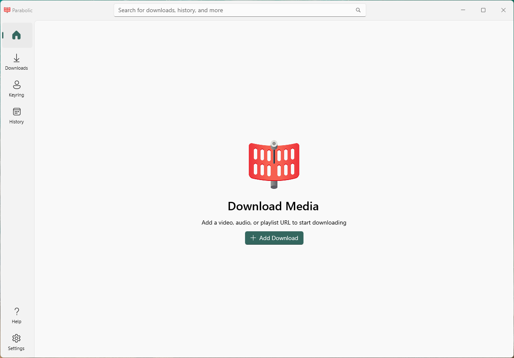
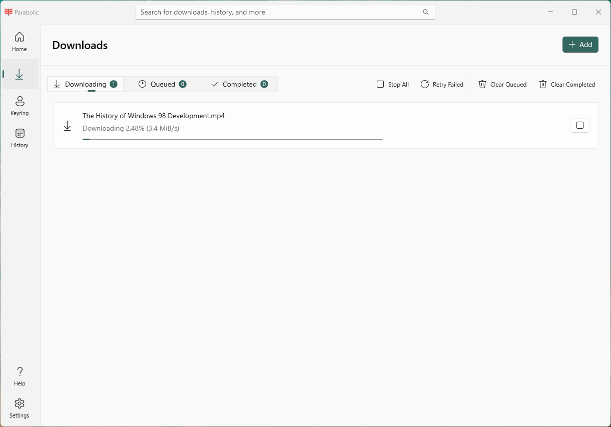
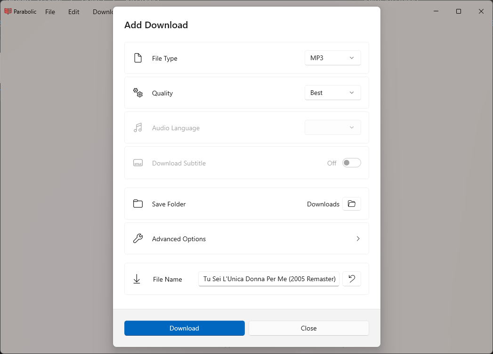

   ✨Powered by [Weblate](https://weblate.org/en/)✨

# Features
- A basic yt-dlp frontend ([supported sites](https://github.com/yt-dlp/yt-dlp/blob/master/supportedsites.md))
- Supports downloading videos in multiple formats (mp4, webm, mp3, opus, flac, and wav)
- Run multiple downloads at a time
- Supports downloading metadata and video subtitles

# Disclaimer
The authors of Nickvision Parabolic are not responsible/liable for any misuse of this program that may violate local copyright/DMCA laws. Users use this application at their own risk.

# Installation

# Chat

# Contributing
See [CONTRIBUTING.md](CONTRIBUTING.md) for details on how can you help the project and how to provide information so we can help you in case of troubles with the app.

# Screenshots

 
GNOME

 
 
 
 

 
WinUI

 
 
 
 

# Dependencies
- [.NET 7](https://dotnet.microsoft.com/en-us/)
- [ffmpeg](https://ffmpeg.org/)
- [python](https://python.org/)
- [yt-dlp (As python module)](https://github.com/yt-dlp/yt-dlp)
- [psutil (As python module)](https://github.com/giampaolo/psutil)

# Code of Conduct
This project follows the [GNOME Code of Conduct](https://wiki.gnome.org/Foundation/CodeOfConduct).
