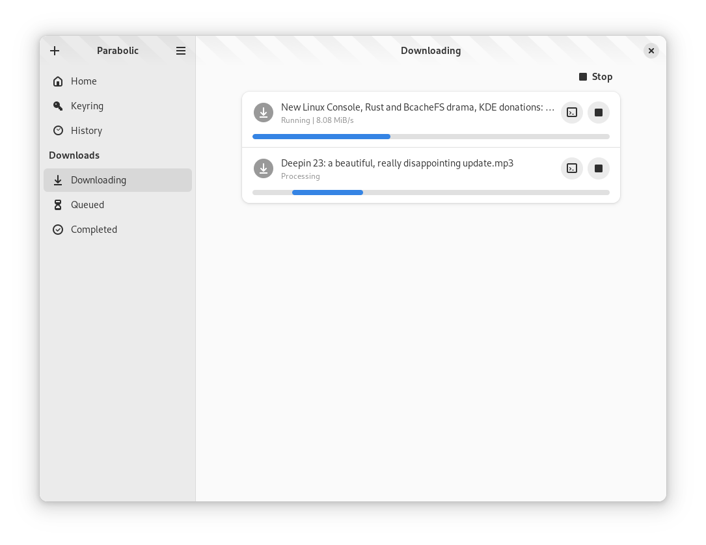

<div align="center">


# 🎬 Parabolic

### *A powerful yt-dlp frontend*

[](https://hosted.weblate.org/engage/nickvision-tube-converter/)
[](https://weblate.org/en/)

[Features](#-features) •
[Installation](#-installation) •
[Screenshots](#-screenshots) •
[Building](#-building-manually) •
[Contributing](#-contributing)

</div>

---

## ✨ Features

<table>
<tr>
<td width="50%">

### 🌐 Versatile Downloads
Powerful frontend for **yt-dlp** with support for [hundreds of sites](https://github.com/yt-dlp/yt-dlp/blob/master/supportedsites.md)

### 🎵 Multiple Formats
Download in **mp4**, **webm**, **mp3**, **opus**, **flac**, and **wav**

</td>
<td width="50%">

### ⚡ Concurrent Downloads
Run **multiple downloads** at the same time

### 📝 Complete Metadata
Support for downloading **metadata** and **video subtitles**

</td>
</tr>
</table>

---

## ⚖️ Legal Copyright Disclaimer

> **Warning:** Videos on YouTube and other sites may be subject to DMCA protection. The authors of Parabolic do not endorse, and are not responsible for, the use of this application in means that will violate these laws.

---

## 📥 Installation

<div align="center">

### Choose your platform

<table>
<tr>
<td align="center" width="33%">

### Linux

<a href='https://flathub.org/apps/details/org.nickvision.tubeconverter'>

</a>

**or via Snap**

<a href="https://snapcraft.io/tube-converter">

</a>

</td>
<td align="center" width="33%">

### Windows

<a href="https://github.com/NickvisionApps/Parabolic/releases">

</a>

Download the latest version from **Releases**

</td>
<td align="center" width="33%">

### Firefox Extension

[](https://addons.mozilla.org/en-US/firefox/addon/parabolic/)

</td>
</tr>
</table>

### 🌍 Translation Status

[](https://hosted.weblate.org/engage/nickvision-tube-converter/)

**Help us translate Parabolic!** [Click here to contribute](https://hosted.weblate.org/projects/nickvision-tube-converter/)

</div>

---

## 💬 Chat & Community

<div align="center">

Join our community on Matrix!

<a href='https://matrix.to/#/#nickvision:matrix.org'>

</a>

</div>

---

## 🤝 Contributing

We'd love your contribution! See [**CONTRIBUTING.md**](CONTRIBUTING.md) for details on:

- 🐛 How to report bugs
- 💡 How to suggest new features
- 🔧 How to contribute code
- 📖 How to improve documentation

---

## 📸 Screenshots

<details>
<summary><b>🖥️ GNOME Interface</b></summary>

<br>

| Home Page | Active Downloads |
|:---:|:---:|
|  |  |

| Dark Mode | Add Download |
|:---:|:---:|
|  |  |

</details>

<details>
<summary><b>🪟 Windows Interface (WinUI)</b></summary>

<br>

| Home Page | Active Downloads |
|:---:|:---:|
|  |  |

| Dark Mode | Add Download |
|:---:|:---:|
|  |  |

</details>

<details>
<summary><b>🧩 Extensão Chrome</b></summary>

<br>

<video width="800" height="600" controls>
  <source src="extension/resources/chrome.mp4" type="video/mp4">
</video>

</details>

<details>
<summary><b>🦊 Extensão Firefox</b></summary>

<br>

<video width="800" height="600" controls>
  <source src="extension/resources/firefox.mp4" type="video/mp4">
</video>

</details>

---

## 🔨 Building Manually

### 📋 Prerequisites

- **cmake** - Build system
- **vcpkg** - Dependency manager (optional)
- **C++20 compiler**

### 📦 Dependencies

#### All Platforms
- `libnick`
- `boost-date-time`

#### Linux
- `blueprint-compiler` *(not available via vcpkg)*
- `libxmlpp`

### ⚙️ Configuring vcpkg

1. Set the `VCPKG_ROOT` environment variable to your vcpkg installation's root directory

#### 🪟 Windows
```bash
# Set environment variable
VCPKG_DEFAULT_TRIPLET=x64-windows

# Install dependencies
vcpkg install libnick boost-date-time
```

#### 🐧 Linux
```bash
# Set environment variable
VCPKG_DEFAULT_TRIPLET=x64-linux

# Install dependencies
vcpkg install libnick libxmlpp boost-date-time
```

### 🏗️ Build Process

#### 🪟 Windows (Installable)
```bash
# Clone the repository and navigate to it
git clone [repo-url]
cd parabolic

# Create and enter build folder
mkdir build && cd build

# Configure the project
cmake .. -G "Visual Studio 17 2022"

# Build
cmake --build . --config Release

# Binaries will be in: build/org.nickvision.tubeconverter.winui/Release
```

#### 🪟 Windows (Portable)
```bash
# Same process, but with additional flag
cmake .. -G "Visual Studio 17 2022" -DBUILD_AS_PORTABLE=ON
cmake --build . --config Release
```

#### 🐧 Linux
```bash
# Clone the repository and navigate to it
git clone [repo-url]
cd parabolic

# Create and enter build folder
mkdir build && cd build

# Configure and build
cmake .. -DCMAKE_BUILD_TYPE=Release
cmake --build .

# Binaries will be in: build/org.nickvision.tubeconverter.gnome
```

---

## 📜 Code of Conduct

This project follows the [**GNOME Code of Conduct**](https://conduct.gnome.org/).

We expect all participants to treat each other with respect and contribute to a welcoming and inclusive community.
